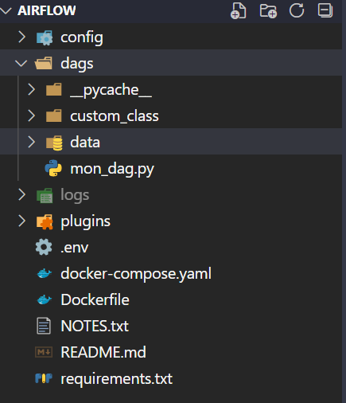

# Apache Airflow

## Structuring
- `dags/` Folder synchronously with our container, it is in this folder that the dags will be written.
- `logs/` Contains the logs of our application.
- `plugins/` Will contain external plugins not present on the docker image

```bash
Airflow/
 |-- dags/
 | |-- custom_class/
 | |-- data/
 | | -- | --input_files/
 | | -- | --output_files/
 |-- logs/
 |-- plugins/
```


`requirements.txt` will contain the external dependencies we will need

## Deployment

To launch the project
```
echo -e "AIRFLOW_UID=$(id -u)\nAIRFLOW_GID=0" > .env
docker-compose up airflow-init
docker build . --tag extending_airflow:latest
docker-compose up -d --no-deps --build airflow-webserver airflow-scheduler
```
and finally
```
docker-compose up 
```

then open your browser `localhost:8080`
